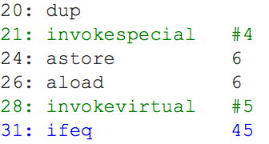
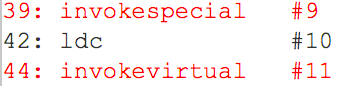

## Lab 1
Задания описаны в классах пакета `ru.sberbank.lab2`. Полученные результаты по каждому из пунктов каждого класса оформить в любом текстовом файле и отправить в телегу. Ответы оформлять подробно: что наблюдали, почему наблюдаемое такое, какое оно есть. Все вопросы или замечания направляйте также мне в телегу. 

#### Дедлайн: 15 декабря 23:59. 

## Lab 2
Сравнить при помощи [JMH](https://github.com/openjdk/jmh) десериализацию/сериализацию json vs protobuf какого-то стандартного DTO.
Сделать бенчмарки и обосновать, какой из сериализаторов предпочтительней и где.
Сделать пуллреквест и отправить ссылку на него в личку в телеграмм.

#### Дедлайн - 15 декабря 23:59.

## Lab 3
Вам требуется запустить код классов `ru.sberbank.lab3.FirstTask` и `ru.sberbank.lab3.SecondTask`, собрать лог JIT-компиляции и посмотреть их в JitWatch. Все оптимизации, произведенные JIT-компилятором и которые подсвечены в JitWatch в байткоде или в Chain, описать: что это такое, почему она произошла. Пример того, что надо описать на картинках ниже подсвечено красным, зеленым и синим:

Также, в коде вы найдете комментарии, в них содержатся пронумерованные вопросы, на которые надо ответить.
Полученные результаты по каждому из пунктов каждого класса оформить в любом текстовом файле и отправить в телегу. Все вопросы или замечания направляйте также мне в телегу. 

#### Дедлайн: 15 декабря 23:59.
