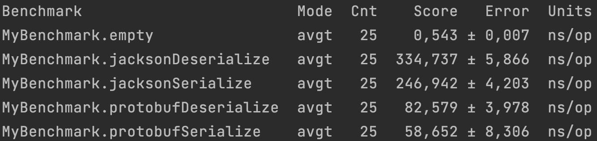

Как видно на простой Dtoшке protobuf оказался значительно быстрее в обоих случаях

Если же нужен человекочитаемый формат и не сильно важна разница в скорости в несколько раз, то выигрывает конечно json