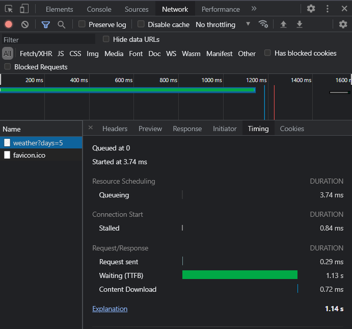
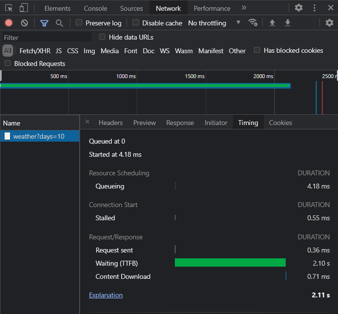
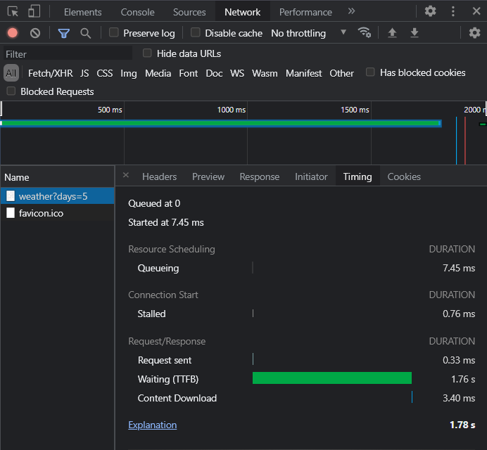
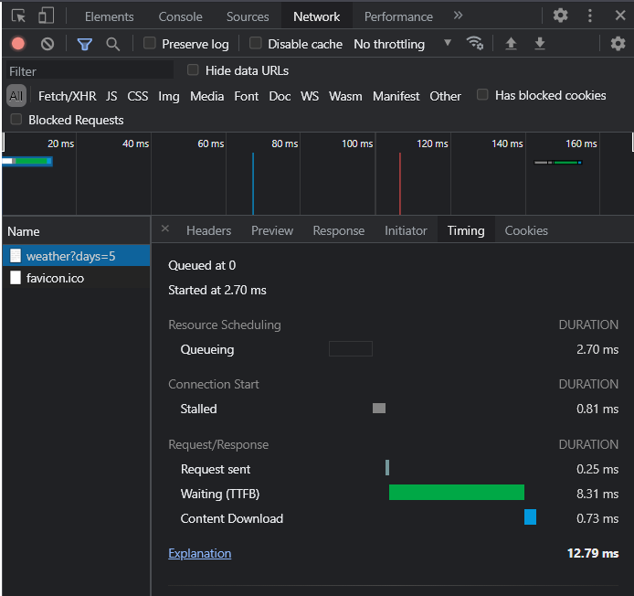

###Lab 1
####Первоначальные замеры:
+ 5 дней

+ 10 дней


####Оптимизации

+ #####Избавление от инициализации лишних объектов

Пример:

До
```java
JSONObject json = new JSONObject(info);
String hourly = json.getString("hourly");
JSONArray data = new JSONObject(hourly).getJSONArray("data");
Double temp = new JSONObject(data.get(0).toString()).getDouble("temperature");
return temp;
```
После
```java
return new JSONObject(info)
                .getJSONObject(hourly)
                .getJSONArray(data)
                .getJSONObject(0)
                .getDouble(temperature);
```
+ #####Замена ```String``` на ```StringBuilder```(при конкатенации)

Пример

До
```java
String obligatoryForecastStart = "https://api.darksky.net/forecast/ac1830efeff59c748d212052f27d49aa/";
String LAcoordinates = "34.053044,-118.243750,";
String exclude = "exclude=daily";
String fooResourceUrl = obligatoryForecastStart + LAcoordinates + date + "?" + exclude;
```

После
```java
StringBuilder fooResourceUrl = new StringBuilder()
                .append(obligatoryForecastStart)
                .append(LAcoordinates)
                .append(date)
                .append("?")
                .append(exclude);
```

+ #####Вынесения констант за пределы циклов и часто используемых методов

После

```java
private final String obligatoryForecastStart = "https://api.darksky.net/forecast/ac1830efeff59c748d212052f27d49aa/";
private final String LAcoordinates = "34.053044,-118.243750,";
private final String exclude = "exclude=daily";
private final String hourly = "hourly";
private final String data = "data";
private final String temperature = "temperature";
```

+ #####Приведение ссылочных типов к примитивным(где это возможно)

До
```java
Long currentDayInSec = Calendar.getInstance().getTimeInMillis() / 1000;
Long oneDayInSec = 24 * 60 * 60L;
Long curDateSec = currentDayInSec - i * oneDayInSec;
```

После
```java
long currentDayInSec = Calendar.getInstance().getTimeInMillis() / 1000;
long oneDayInSec = 24 * 60 * 60L;
long curDateSec = currentDayInSec - i * oneDayInSec;
```
+ #####Кеширование информации о погоде

Подробнее: было замечено, что запрос возврацает
 термпратуру в 7AM в зоне "___America/Los_Angeles___"
  Эта температура была закеширована
  (хеш-таблица<timestamp,температура>)
  
 ```java
private final Map<Long,Double> cache = new HashMap<>();

public long get7AMInLA () {
    ZoneId zone = ZoneId.of(US_LA);
    LocalDateTime sevenAMInLA = LocalDate.now().atStartOfDay();
    ZoneOffset zoneOffSet = zone.getRules().getOffset(sevenAMInLA);
    return sevenAMInLA.toEpochSecond(zoneOffSet);
    }

public List<Double> getTemperatureForLastDays(int days) throws JSONException {
        List<Double> temps = new ArrayList<>();
        long timeInLA = get7AMInLA();
        double curTemp;
        for (int i = 0; i < days; i++) {
            timeInLA -= i * oneDayInSec;
            if (cache.containsKey(timeInLA)) {
                temps.add(cache.get(timeInLA));
            } else {
                curTemp = getTemperatureFromInfo(Long.toString(timeInLA));
                cache.put(timeInLA,curTemp);
                temps.add(curTemp);
            }
        }
        return temps;
    }
```

####Результаты

+  Первый запрос

+  Последующие запросы

